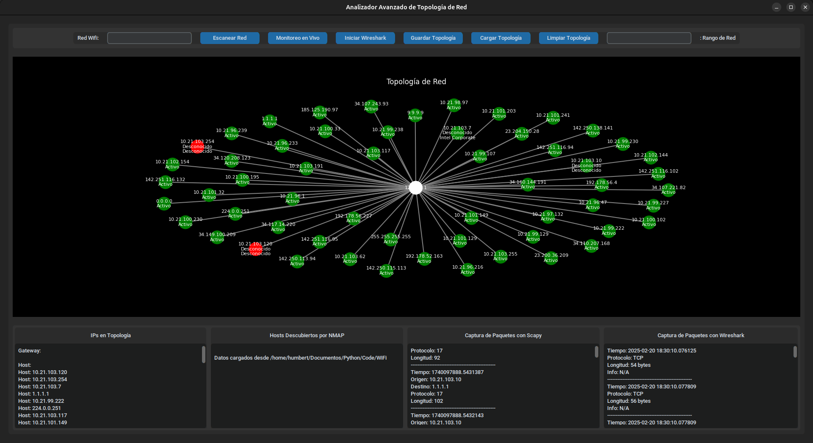

# WiFi Network Topology Analyzer

---

## Descripción

Este codigo Python pertenecea a un Analizador de Topología de Red avanzada que visualiza y analiza la topología de la red WiFi en tiempo real. 

---

### Características

- **Escaneo de Red**: Descubra todos los dispositivos de su red local utilizando NMAP

- **Monitorización en vivo**: Observe el tráfico de red en tiempo real con representación visual

- **Captura de paquetes**: Funcionalidad Scapy y Wireshark integrada para inspección profunda de paquetes

- **Visualización interactiva**: Representación gráfica dinámica de la topología de red

- **Persistencia de datos**: Guarda y carga los datos de topología de red para su posterior análisis

- **UI en modo oscuro**: Interfaz moderna y limpia creada con CustomTkinter

---

### Requisitos en del Dispositivo

- Python 3.7+
  
- WireShark
  
- TShark

- Linux
  
- NMap

---

### Paquetes Python necesarios

- customtkinter
  
- tkinter

- python-nmap
  
- matplotlib
 
- networkx
  
- pyshark
 
- scapy
  
- psutil

---
